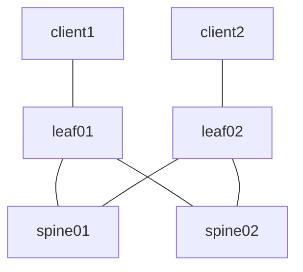

# cRPD-based EVPN VXLAN

EVPN-VXLAN 3-stage IP CLOS fabric using Juniper [cRPD](https://www.juniper.net/documentation/us/en/software/crpd/crpd-deployment/index.html) to facilitate Layer 2 connectivity between ```client1``` and ```client2```

## Topology



## Requirements

* Python >= 3.10
* Docker [image](https://www.juniper.net/documentation/us/en/software/crpd/crpd-deployment/topics/task/crpd-linux-server-install.html#id-loading-the-crr-image) for cRPD (on the host running this CONTAINERlab setup)
  * Adjust the ```image``` directive in [setup.yml](setup.yml) to reflect the image and tag assigned to the cRPD container. For instance, in this lab, I am using ```crpd:22.4R1-S2.1```
* A valid cRPD license key placed in a file called 'junos_sfnt.lic' at the root of the repository (same level as [setup.yml](setup.yml))

## Resources

### IP Assignments

_**NOTE**: The Overlay/VTEP assignments for spine01/spine02 are not actually implemented, or even required, since our VTEP's in this lab are on leaf01/leaf02. The assignments are therefore just for consistency purposes_

| Scope              | Network       | Sub-Network   | Assignment    | Name            |
| ------------------ | ------------- | ------------- | ------------- | -------         |
| Management         | 10.0.0.0/24   |               | 10.0.0.2/24   | spine01         |
| Management         | 10.0.0.0/24   |               | 10.0.0.3/24   | spine02         |
| Management         | 10.0.0.0/24   |               | 10.0.0.4/24   | leaf01          |
| Management         | 10.0.0.0/24   |               | 10.0.0.5/24   | leaf02          |
| Router ID (lo0.0)  | 10.1.0.0/24   |               | 10.1.0.1/32   | spine01         |
| Router ID (lo0.0)  | 10.1.0.0/24   |               | 10.1.0.2/32   | spine02         |
| Router ID (lo0.0)  | 10.1.0.0/24   |               | 10.1.0.3/32   | leaf01          |
| Router ID (lo0.0)  | 10.1.0.0/24   |               | 10.1.0.4/32   | leaf02          |
| P2P Links          | 10.2.0.0/24   | 10.2.0.0/31   | 10.2.0.0/31   | spine01::leaf01 |
| P2P Links          | 10.2.0.0/24   | 10.2.0.0/31   | 10.2.0.1/31   | leaf01::spine01 |
| P2P Links          | 10.2.0.0/24   | 10.2.0.2/31   | 10.2.0.2/31   | spine01::leaf02 |
| P2P Links          | 10.2.0.0/24   | 10.2.0.2/31   | 10.2.0.3/31   | leaf02::spine01 |
| P2P Links          | 10.2.0.0/24   | 10.2.0.4/31   | 10.2.0.4/31   | spine02::leaf01 |
| P2P Links          | 10.2.0.0/24   | 10.2.0.4/31   | 10.2.0.5/31   | leaf01::spine02 |
| P2P Links          | 10.2.0.0/24   | 10.2.0.6/31   | 10.2.0.6/31   | spine02::leaf02 |
| P2P Links          | 10.2.0.0/24   | 10.2.0.6/31   | 10.2.0.7/31   | leaf02::spine02 |

### Underlay ASN Assignments

| ASN   | Device  |
| ----- | ------- |
| 65500 | spine01 |
| 65501 | spine02 |
| 65502 | leaf01  |
| 65503 | leaf02  |

### Overlay ASN Assignment

| ASN   | Device  |
| ----- | ------- |
| 65599 | all     |

### VXLAN Segments

| vni | name | network      | leaf   | host    | host ip   | vlan |
| --- | ---- | ------------ | ------ | ------- | --------- | ---- |
| 110 | RED  | 10.10.1.0/24 | leaf01 | client1 | 10.10.1.1 | 10   |
| 110 | RED  | 10.10.1.0/24 | leaf02 | client2 | 10.10.1.2 | 10   |

## Deployment

Change into the lab directory and start the lab

```shell
cd labs/crpd/evpn-vxlan-01/
make start
```

* Creates the [CONTAINERlab network](https://containerlab.dev/manual/topo-def-file/) based on the [setup.yml](setup.yml) topology definition
* Apply's the configuration from the spine/leaf folders as "startup" configuration on each cRPD host
* Apply's a cRPD license on each cRPD host. Please refer to the [Requirements](#requirements)

| # |            Name            | Container ID |      Image       | Kind |  State  | IPv4 Address  | IPv6 Address |
| - | -------------------------- | ------------ | ---------------- | ---- | ------- | ------------- | ------------ |
| 1 | clab-evpn-vxlan-01-spine01 | 6a4cc9fbb36c | crpd:22.4R1-S2.1 | crpd | running | 172.29.1.2/24 | N/A          |

## Access

...

## Cleanup

Stop the lab, tear down the CONTAINERlab containers

```shell
make clean
```

## Validation

```shell
make validate
```

* Executes a PING from ```client1``` to ```client2``` and if it fails, executes a testing sequence
