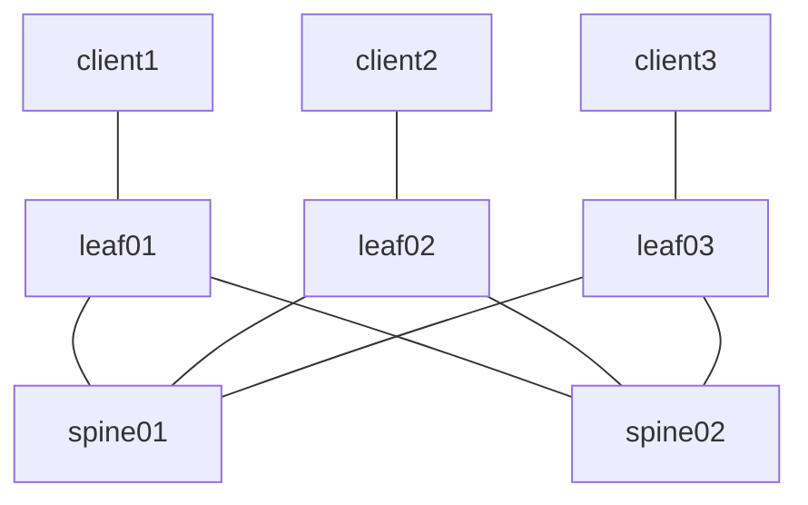

# cRPD-based EVPN VXLAN

3-stage Layer 3 Leaf/Spine (L3LS) IP fabric using Juniper [cRPD](https://www.juniper.net/documentation/us/en/software/crpd/crpd-deployment/index.html) to facilitate Layer 2 (intra-VNI) connectivity between ```client1``` & ```client2``` and Layer 3 (inter-VNI) connectivity between ```client```, ```client2```, & ```client3```, with EVPN and VXLAN. The fabric generally follows the [Edge-Routed Bridging Overlay](https://www.juniper.net/documentation/us/en/software/nce/sg-005-data-center-fabric/topics/task/edge-routed-overlay-cloud-dc-configuring.html) design guide and utilizes the MAC-VRF routing instance type.

## Topology



## Requirements

* CONTAINERlab >= 0.54.2 (as detailed in the top-level [README](../../../README.md))
* Python >= 3.10
* Docker Community Edition >= 26.1.4
* Docker cRPD [image](https://www.juniper.net/documentation/us/en/software/crpd/crpd-deployment/topics/task/crpd-linux-server-install.html#id-loading-the-crr-image) >= 22.4R1-S2.1
  * NOTE: You will need to adjust the ```image``` value in [setup.yml](setup.yml) to reflect the image and tag assigned

```shell
$ docker image ls | grep crpd
crpd                       22.4R1-S2.1    9ed0a701769a   14 months ago   546MB
```

* A valid cRPD license key placed in a file called ```junos_sfnt.lic``` at the root of the repository (same level as [setup.yml](setup.yml))

## Resources

### IP Assignments

_**NOTE**: The Overlay/VTEP assignments for spine01/spine02 are not actually implemented, or even required, since our VTEP's in this lab are on leaf01/leaf02/leaf03. The assignments are therefore just for consistency purposes_

| Scope              | Network       | Sub-Network    | Assignment     | Name            |
| ------------------ | ------------- | -------------  | -------------  | -------         |
| Management         | 10.0.0.0/24   |                | 10.0.0.2/24    | spine01         |
| Management         | 10.0.0.0/24   |                | 10.0.0.3/24    | spine02         |
| Management         | 10.0.0.0/24   |                | 10.0.0.4/24    | leaf01          |
| Management         | 10.0.0.0/24   |                | 10.0.0.5/24    | leaf02          |
| Management         | 10.0.0.0/24   |                | 10.0.0.6/24    | leaf03          |
| Router ID (lo0.0)  | 10.1.0.0/24   |                | 10.1.0.1/32    | spine01         |
| Router ID (lo0.0)  | 10.1.0.0/24   |                | 10.1.0.2/32    | spine02         |
| Router ID (lo0.0)  | 10.1.0.0/24   |                | 10.1.0.3/32    | leaf01          |
| Router ID (lo0.0)  | 10.1.0.0/24   |                | 10.1.0.4/32    | leaf02          |
| Router ID (lo0.0)  | 10.1.0.0/24   |                | 10.1.0.5/32    | leaf03          |
| P2P Links          | 10.2.0.0/24   | 10.2.0.0/31    | 10.2.0.0/31    | spine01::leaf01 |
| P2P Links          | 10.2.0.0/24   | 10.2.0.0/31    | 10.2.0.1/31    | leaf01::spine01 |
| P2P Links          | 10.2.0.0/24   | 10.2.0.2/31    | 10.2.0.2/31    | spine01::leaf02 |
| P2P Links          | 10.2.0.0/24   | 10.2.0.2/31    | 10.2.0.3/31    | leaf02::spine01 |
| P2P Links          | 10.2.0.0/24   | 10.2.0.4/31    | 10.2.0.4/31    | spine02::leaf01 |
| P2P Links          | 10.2.0.0/24   | 10.2.0.4/31    | 10.2.0.5/31    | leaf01::spine02 |
| P2P Links          | 10.2.0.0/24   | 10.2.0.6/31    | 10.2.0.6/31    | spine02::leaf02 |
| P2P Links          | 10.2.0.0/24   | 10.2.0.6/31    | 10.2.0.7/31    | leaf02::spine02 |
| P2P Links          | 10.2.0.0/24   | 10.2.0.8/31    | 10.2.0.8/31    | spine01::leaf03 |
| P2P Links          | 10.2.0.0/24   | 10.2.0.8/31    | 10.2.0.9/31    | leaf03::spine01 |
| P2P Links          | 10.2.0.0/24   | 10.2.0.10/31   | 10.2.0.10/31   | spine02::leaf03 |
| P2P Links          | 10.2.0.0/24   | 10.2.0.10/31   | 10.2.0.11/31   | leaf03::spine02 |

### Underlay ASN Assignments

| ASN   | Device  |
| ----- | ------- |
| 65500 | spine01 |
| 65501 | spine02 |
| 65502 | leaf01  |
| 65503 | leaf02  |
| 65504 | leaf03  |

### Overlay ASN Assignment

| ASN   | Device  |
| ----- | ------- |
| 65555 | all     |

### VXLAN Segments

| vni | name  | network      | leaf   | host    | host ip   | vlan | gateway     |
| --- | ----  | ------------ | ------ | ------- | --------- | ---- | ----------- |
| 110 | RED   | 10.10.1.0/24 | leaf01 | client1 | 10.10.1.1 | 10   | 10.10.1.254 |
| 110 | RED   | 10.10.1.0/24 | leaf02 | client2 | 10.10.1.2 | 10   | 10.10.1.254 |
| 120 | BLUE  | 10.10.2.0/24 | leaf03 | client3 | 10.10.2.1 | 20   | 10.10.2.254 |

### VXLAN Tenants

| vni | name   |
| --- | ----   |
| 999 | ORANGE |

## Deployment

Change into this lab directory from the root of the repository

```shell
cd labs/crpd/evpn-vxlan-01/
```

### Create the lab

```shell
make lab
```

* Creates the [CONTAINERlab topology](https://containerlab.dev/manual/topo-def-file/) based on the [setup.yml](setup.yml) topology definition
  * Apply's the bootstrap JUNOS configuration from the respective ```spine``` or ```leaf``` folders on each cRPD host
* Apply's a cRPD license on each cRPD host

```markdown
+---+----------------------------+--------------+--------------------------------------+-------+---------+--------------+--------------+
| # |            Name            | Container ID |                Image                 | Kind  |  State  | IPv4 Address | IPv6 Address |
+---+----------------------------+--------------+--------------------------------------+-------+---------+--------------+--------------+
| 1 | clab-evpn-vxlan-01-client1 | 579d849a2a9f | wbitt/network-multitool:alpine-extra | linux | running | 10.0.0.7/24  | N/A          |
| 2 | clab-evpn-vxlan-01-client2 | 881a975e73b2 | wbitt/network-multitool:alpine-extra | linux | running | 10.0.0.8/24  | N/A          |
| 3 | clab-evpn-vxlan-01-client3 | 7b3c2145305a | wbitt/network-multitool:alpine-extra | linux | running | 10.0.0.9/24  | N/A          |
| 4 | clab-evpn-vxlan-01-leaf01  | 1df583ac3d6f | crpd:22.4R1-S2.1                     | crpd  | running | 10.0.0.4/24  | N/A          |
| 5 | clab-evpn-vxlan-01-leaf02  | c8a98f69792d | crpd:22.4R1-S2.1                     | crpd  | running | 10.0.0.5/24  | N/A          |
| 6 | clab-evpn-vxlan-01-leaf03  | 1761d67ed168 | crpd:22.4R1-S2.1                     | crpd  | running | 10.0.0.6/24  | N/A          |
| 7 | clab-evpn-vxlan-01-spine01 | 45435efce333 | crpd:22.4R1-S2.1                     | crpd  | running | 10.0.0.2/24  | N/A          |
| 8 | clab-evpn-vxlan-01-spine02 | 50d42358019c | crpd:22.4R1-S2.1                     | crpd  | running | 10.0.0.3/24  | N/A          |
+---+----------------------------+--------------+--------------------------------------+-------+---------+--------------+--------------+
```

### Configure the lab

```shell
make configure
```

* Executes an Ansible playbook for creating the fabric underlay/overlay and EVPN/VXLAN configuration
* Apply's the Linux configuration from the ```clients``` folders to each Linux host

## Validation

```shell
make validate
```

* Executes a PING from ```client1``` to ```client2``` for validating Layer 2 (intra-VNI) connectivity
* Executes a PING from ```client1``` to ```client3``` for validating Layer 3 (inter-VNI) connectivity

## Cleanup

Stop the lab, tear down the CONTAINERlab containers

```shell
make clean
```

## Access

The individual CONTAINERlab hosts can be accessed as follows:

* SHELL access
  * ```docker exec -it clab-evpn-vxlan-01-spine01 bash```

* CLI access
  * ```docker exec -it clab-evpn-vxlan-01-spine01 cli```

## Capturing packets

Here is an example on how to capture packets directly on the host which CONTAINERlab is running

```sudo ip netns exec clab-evpn-vxlan-01-leaf01 tcpdump -nni eth1```

Here is an example on how to capture packets from a remote host, to the host which CONTAINERlab is running (Note that this example is piping directly to Wireshark which in my case is running on my MAC OS X host)

```ssh [ containerlab host ] "sudo -S ip netns exec [ containerlab container name ] tcpdump -nni eth1 -w -" | /Applications/Wireshark.app/Contents/MacOS/Wireshark -k -i -```

## TODO

* Create individual Ansible tasks for configuring the devices according to the modules available in the 'junipernetworks.junos' collection
* Create a set of regression tests if the PING in the [Validation](#validation) step fails
* Configure JTI and add a containerized 'TIG' stack for monitoring the fabric
